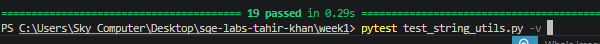

# 🚀 SQE Lab 1: String Utilities Module (Graded Task)

## 👤 Student Information
**Name:** Tahir khan  
**Registration ID:** FA23-BSE-030  
**Course:** Software Quality Engineering (SQE)  
**University:** Mirpur University of Science and Technology (MUST)

---

## 📝 Project Overview
This project implements a **String Utilities Module** (`string_utils.py`) with 6 core text-processing functions. The implementation is verified using a comprehensive **Pytest** suite ensuring reliability, edge case handling, and professional exception management.

### Implemented Functions:
* **Count Vowels:** Returns count of (a, e, i, o, u) - Case-insensitive.
* **Reverse String:** Reverses the input string.
* **Is Palindrome:** Checks for palindromes, ignoring spaces and case.
* **Word Count:** Counts words separated by whitespace.
* **Capitalise Words:** Capitalizes the first letter of every word.
* **Remove Duplicates:** Removes consecutive repeating characters.

---

## ✅ Test Execution Results
I have implemented **19 individual test cases** covering all 6 functions. 

---

## 📊 Code Coverage
Achieved **100% Statement Coverage** for `string_utils.py`.

> **Note:** The full execution report has been generated and saved as a text file in the repository.
> [View Coverage Report](./coverage_report.txt)
